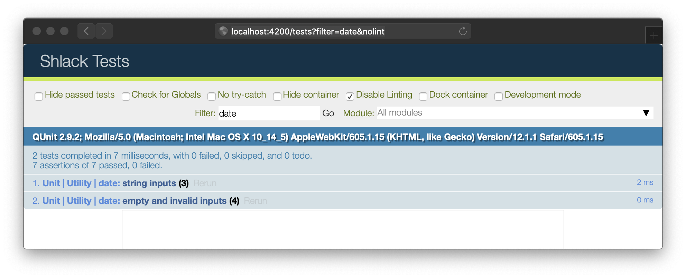

# Helpers

Helpers are like simple functions that can be used in templates. We'll create a simple one to allow us to create a string representation of a `Date` (or a `string`/`number` passed to the `Date` constructor). Something like [Moment.js](http://momentjs.com/) would be able to perform a similar task, but given that it's fairly large (16.7k minified, gzipped) is's overkill for just this one thing.

## The `dateToString` utility

Your app's `app/utils` folder is a great place for low-level utilities. Let's generate a `utils` module for date-related concerns.

```sh
ember generate utils date
```

- [`app/utils/date.js`](../app/utils/date.js) - the utils module
- [`tests/unit/utils/date-test.js`](../tests/unit/utils/date-test.js) - a passing unit test

Replace the contents of [`app/utils/date.js`](../app/utils/date.js) with the following

<details>
  
  <summary>Click to reveal <code>date.js</code></summary>

```js
const MONTH_NAMES = [
  'Jan',
  'Feb',
  'Mar',
  'Apr',
  'May',
  'Jun',
  'Jul',
  'Aug',
  'Sep',
  'Oct',
  'Nov',
  'Dec',
];

/**
 * Pad a numeric value with zeroes, if needed
 *
 * @example
 *
 * padLeadingZeroes(13, 4); // "0013"
 * padLeadingZeroes(130, 2); // "130"
 *
 * @param {number} val value
 * @param {number} digits number of digits to pad
 * @returns {string}
 */
function padLeadingZeroes(val, digits) {
  let valString = `${val}`;
  while (valString.length < digits) valString = 0 + valString;
  return valString;
}

/**
 * Create a string representation of a Date
 * @param {string|number|Date} date
 * @returns {string}
 */
export function dateToString(date) {
  if (
    !(
      typeof date === 'string' ||
      typeof date === 'number' ||
      date instanceof Date
    )
  )
    return null;
  const d = new Date(date);
  const ampm = d.getHours() > 12 ? 'PM' : 'AM';
  return `${
    MONTH_NAMES[d.getMonth()]
  } ${d.getDate()}, ${d.getFullYear()} ${padLeadingZeroes(
    d.getHours() % 12,
    2
  )}:${padLeadingZeroes(d.getMinutes(), 2)}.${padLeadingZeroes(
    d.getSeconds(),
    2
  )} ${ampm}`;
}
```

</details>

### Unit test

Now, let's fill in the regular [QUnit](http://qunitjs.com) test module that Ember CLI created for us

<details>

<summary>Click to reveal <code>date-test.js</code></summary>

```js
import { dateToString } from 'shlack/utils/date';
import { module, test } from 'qunit';

module('Unit | Utility | date', function() {
  // Replace this with your real tests.
  test('string inputs', function(assert) {
    assert.equal(
      dateToString('04/05/1983'),
      'Apr 5, 1983 00:00.00 AM',
      'MM/DD/YYYY'
    );
    assert.equal(
      dateToString('4/5/1983'),
      'Apr 5, 1983 00:00.00 AM',
      'M/D/YYYY'
    );
    assert.equal(
      dateToString('26 June 2010 13:14'),
      'Jun 26, 2010 01:14.00 PM',
      '26 June 2010 13:14'
    );
  });

  test('empty and invalid inputs', function(assert) {
    // @ts-ignore
    assert.equal(dateToString(), null);
    // @ts-ignore
    assert.equal(dateToString(null), null);
    // @ts-ignore
    assert.equal(dateToString([]), null);
    // @ts-ignore
    assert.equal(dateToString({}), null);
  });
});
```

</details>

Now we can go to http://localhost:4200/tests?filter=date&nolint and see the QUnit UI, showing our test passing



## The `{{format-timestamp}}` helper

We can use Ember CLI to generate a starting point for our helper, as well as an integration test.

```sh
ember generate helper format-timestamp
```

- [`app/helpers/format-timestamp.js`](../app/helpers/format-timestamp.js) - the helper
- [`tests/integration/helpers/format-timestamp-test.js`](../tests/integration/helpers/format-timestamp-test.js) - a passing integration test

The starting point code for [`app/helpers/format-timestamp.js`](../app/helpers/format-timestamp.js) will look something like this:

```js
import { helper } from '@ember/component/helper';

export default helper(function formatTimestamp(params, hash) {
  return params;
});
```

when a helper is used in a helper like this

```hbs
{{format-timestamp "a" "b" c="hello" e="world"}}
```

`format-timestamp` can be thought of as a function to invoke, and everything that follows it can be thought of as arguments passed to that function via `params` and `hash`.

| `hbs`                                 | `params`     | `hash`                       |
| ------------------------------------- | ------------ | ---------------------------- |
| `{{foo "a" "b"}}`                     | `['a', 'b']` | `{}`                         |
| `{{foo c="hello"}}`                   | `[]`         | `{ c: 'hello' }`             |
| `{{foo "a" "b" c="hello" d="world"}}` | `['a', 'b']` | `{ c: 'hello', d: 'world' }` |
| `{{foo}}`                             | `[]`         | `{}`                         |

in our case, we want to be able to write something like this

```hbs
{{format-timestamp "05-01-2019"}}
```

so we can expect the string `"05-01-2019"` to be passed to the helper as the 0th element of `params`. We can combine this with [destructuring](https://developer.mozilla.org/en-US/docs/Web/JavaScript/Reference/Operators/Destructuring_assignment#Unpacking_fields_from_objects_passed_as_function_parameter), and end up with a helper implementation in [`app/helpers/format-timestamp.js`](../app/helpers/format-timestamp.js) like

```js
import { helper } from '@ember/component/helper';
import { dateToString } from 'shlack/utils/date';

export default helper(function formatTimestamp([date]) {
  const str = dateToString(date);
  return str || '(unknown)';
});
```

While, we'll see in a moment that writing tests for helpers is quick and easy, I still recommend that helpers of this kind be implemented as a thin layer wrapping some unit-tested pure vanilla JS function. This approach allows you to use the same code in both the `.hbs` and `.js` worlds.

### Integration test

open [`tests/integration/helpers/format-timestamp-test.js`](../tests/integration/helpers/format-timestamp-test.js) so we can work on writing an integration test for the `{{format-timestamp}}` helper we just created

These tests take the form of setting up a scenario using a small piece of [inline-compiled handlebars](https://github.com/ember-cli/ember-cli-htmlbars-inline-precompile), and then making assertions against `this.element`.

I like to think of it as if `` hbs`{{format-timestamp "05-01-2019"}}` `` is transformed into

```hbs
<div> <!-- 👈 this.element -->
  {{format-timestamp "05-01-2019"}}
</div>
```

The starting point for your test should look like this

```js
import { module, test } from 'qunit';
import { setupRenderingTest } from 'ember-qunit';
import { render } from '@ember/test-helpers';
import hbs from 'htmlbars-inline-precompile';

module('Integration | Helper | format-timestmp', function(hooks) {
  setupRenderingTest(hooks);

  // Replace this with your real tests.
  test('it renders', async function(assert) {
    this.set('inputValue', '1234');

    await render(hbs`{{format-timestmp inputValue}}`);

    assert.equal(this.element.textContent.trim(), '1234');
  });
});
```

You can view the current state of the tests by visiting http://localhost:4200/tests?hidepassed. Note that the `{{format-timestamp}}` test is failing. Replace it with

```js
import { module, test } from 'qunit';
import { setupRenderingTest } from 'ember-qunit';
import { render } from '@ember/test-helpers';
import hbs from 'htmlbars-inline-precompile';

module('Integration | Helper | format-timestamp', function(hooks) {
  setupRenderingTest(hooks);

  test('01-01-2019', async function(assert) {
    await render(hbs`{{format-timestamp '01-01-2019'}}`);
    assert.equal(
      ('' + this.element.textContent).trim(),
      'Jan 1, 2019 00:00.00 AM'
    );
  });

  test('No argument passed', async function(assert) {
    await render(hbs`{{format-timestamp}}`);
    assert.equal(('' + this.element.textContent).trim(), '(unknown)');
  });
});
```

We don't have to worry about too much more than this, given that we've already unit tested the interesting part.
